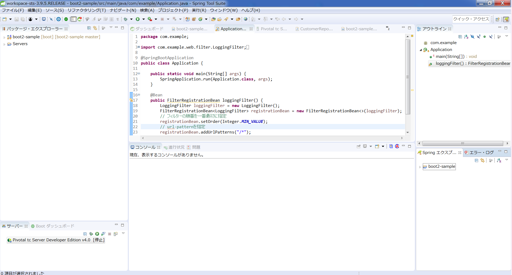

Spring Boot2 動作確認 ハンズオン
================================

# サンプル：顧客管理アプリ
- 顧客の全件一覧表示・新規追加を行えるWebアプリ

# 技術構成
- Webフレームワーク : Spring MVC
- ビュー : Thymeleaf 3
- 入力検証 : Hibernate Validator 6
- データアクセス : Spring Data JDBC
- 認証認可 : Spring Security
- サーバー : 組み込みTomcat
- DB : H2（組み込みDB）

# 開始前に

## 開発環境
- JDK 8 以上
- IntelliJ IDEA または Spring Tool Suite （なるべく最新版）
    - 文字コードは全てUTF-8
- Git
- Maven    

# ハンズオン

## ソースコードのインポート
ソースを配置したいディレクトリにて、下記のコマンドで、GitHubからクローンしてください。

```shell-session
$ git clone https://github.com/h-katsura/boot2-sample.git
```

 IDEにて、ソースコードのimportを行ってください。  
 **★TODO★STSの画面キャプチャを張り付ける　＞大場さん、落合さんよろしく。**
 
 
 
1. Spring Tool Suiteを起動します。
2. [File]-[Import]を選択します。
3. [Maven]-[Existing Maven Projects]を選択して[Next]を選択します。
4. クローンした[boot2-sample]フォルダを選択します。
5. [boot2-sample]のプロジェクトが表示され、チェックが入っていることを確かめて[Finish]を選択します。
6. プロジェクトのインポートが始まります。Maven Centralからライブラリのダウンロードを行うため、しばらく時間がかかります。

## 実行確認
1. [boot2-sample]プロジェクトのcom.example.Applicationクラスにmain()メソッドがあるので、実行してください。  
Spring Tool Suiteの場合、[Run As]-[Java Application]で実行してください。
2. コンソールを確認してください。スタックトレースなどが出ておらず、最後に「情報: Starting ProtocolHandler ["http-nio-8080"]」と表示されていれば、組み込みTomcatがポート番号8080で正しく起動しています。
3. Webブラウザで http://localhost:8080/sample/ にアクセスします。ログイン画面が表示されるので、メールアドレス「admin@example.com」、パスワード「admin」でログインしてください。
4. ログインが成功し、ppt資料にあったように、5人分の顧客情報が表示されれば成功です。
5. main()メソッドを停止してください。これで準備手順は以上です。
